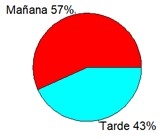

Informe de Estadística Descriptiva
=======
José R. Hilera (Universidad de Alcalá)
# Análisis de las notas de acceso de los estudiantes del Grado en Ingeniería en Sistemas de Información de la Universidad de Alcalá del curso 2021-22

## **1. Introducción**
### Contexto
En la Universidad de Alcalá se imparten diferentes estudios de grado relacionados con las Tecnologías de la Información y las Comunicaciones, entre los que se encuentra el Grado en Ingeniería en Sistemas de Información. Dado el elevado número de alumnos existente, los estudios se organizan en dos turnos: Mañana y Tarde, y en cada turno los alumnos asisten a un grupo de teoría de cada asignatura, pero se reparten en dos grupos diferentes para realizar las prácticas.
### Objetivo
El objetivo de la investigación llevada a cabo ha sido “realizar un análisis estadístico descriptivo de las notas de acceso a la Universidad de Alcalá de los alumnos del Grado en Ingeniería en Sistemas de Información del curso 2021-22, comprobando si hay diferencias entre los alumnos del turno de mañana y de tarde”.
### Alcance
La investigación se limita a los alumnos del curso 2021-22 matriculados en la asignatura Estadística de primero del Grado en Ingeniería en Sistemas de Información, y se ha utilizado una muestra de 74 alumnos de los 108 matriculados en la asignatura.
## **2. Metodología**
### Origen de los datos
Se ha trabajado con un archivo “encuesta.csv” que incluye las notas de la muestra, así como la información sobre el grupo al que pertenece cada alumno, siendo A1 y A2 los grupos del turno de mañana, y B1 y B2 los del turno de tarde. Se ha realizado una encuesta a toda la población de alumnos mediante una encuesta elaborada por el profesor durante la primera semana del curso. 
### Herramientas
Se han procesado los datos utilizando la aplicación RStudio para Windows, versión 2022.07.1 y los paquetes de funciones: “modeest” para calcular la moda, y “e1071” para calcular los coeficientes de asimetría y apunamiento. 
### Diseño
El resumen del diseño es el siguiente:
*	Variables estadísticas:
    * Se ha analizado la variable estadística “Nota de acceso”, que representa “la nota obtenida en la prueba de acceso por un alumno matriculado en la asignatura Estadística del Grado en Ingeniería en Sistemas de Información de la Universidad de Alcalá en el curso 2021-22”, de tipo cuantitativo discreto, con valores positivos que pueden ser mayores o iguales a 5.
    * También se ha utilizado la variable estadística “Turno”, de tipo cualitativo, con valores “Mañana” o “Tarde”.
*	Población: 108 alumnos
    *	Cada individuo de la población representa un alumno matriculado en la asignatura Estadística del Grado en Ingeniería en Sistemas de Información de la Universidad de Alcalá en el curso 2021-22.
*	Muestra: 74 alumnos, de los cuales 42 son del grupo de mañana y 32 del grupo de tarde. 
*	Organización de datos: Se han eliminado del archivo “encuesta.csv” los datos erróneos, resultando un total de 74 observaciones válidas. Se ha modificado el archivo añadiendo una nueva columna TURNO con el valor “Mañana” en el caso de los alumnos de los grupos A1 y A2, y el valor “Tarde” en los alumnos de los grupos B1 y B2.

## **3. Resultados**
### Medidas estadísticas
En la tabla 1 se muestran los resultados de las medidas estadísticas de centralización, dispersión, localización y forma más relevantes, para el total de alumnos de la muestra, y para los alumnos de los turnos de mañana y tarde.

**Tabla 1.** Medidas Estadísticas Descriptivas
   
| Medida                        | Todos       |   Mañana      |    Tarde      |
|-------------------------------|-------------|-----------------|-----------------|
| **Tamaño muestra**            | 74 alumnos | 42 alumnos      | 32 alumnos      |
| **Medidas de centralización** |             |                 |                 |
| Media                         | 8.02 puntos | 8.35 puntos     | 7.59 puntos     |
| Mediana                       | 7.81 puntos |	8.20 puntos | 	7.50 puntos        |
| **Medidas de dispersión**     |             |                 |                 |
| Mínimo                        | 5.80 puntos |	6.75 puntos |	5.80 puntos         |
| Máximo                        | 10.80 puntos|	10.80 puntos|	10.27 puntos      |
| Rango                         | 5.00 puntos |	4.05 puntos |	4.47 puntos      |
| Varianza                      | 1.28 puntos2 |	1.15 puntos2 |	1.17 puntos2       |
| Desviación Estándar           | 1.13 puntos |	1.07 puntos	| 1.08 puntos       |
| Coeficiente Variación         | 0.14 |	0.13	| 0.14           |
| **Medidas de localización**   |             |                 |                 |
| Primer Cuartil (Q1)           | 7.27 puntos |	7.53 puntos |	6.95 puntos          |
| Tercer Cuartil (Q3)           | 8.60 puntos |	8.71 puntos |	7.90 puntos         |
| Rango Intercuartílico (IQR)   | 1.32 puntos |	1.17 puntos |	0.95 puntos        |
| **Medidas de forma**          |             |                 |                 |
| Coeficiente de asimetría      | 0.57 |	0.59 |0.80           |
| Coeficiente de apuntamiento (curtosis) | -0.28 |	-0.64 |	0.31           |
| **Otras medidas**             |             |                 |                 |
| Valores inferiores a la media  | 45 (61%) |	24 (57%) |	18 (56%)   |
| Valores superiores a la media  | 29 (39%) |	18 (43%) |	14 (44%) |

### Tablas de contingencia
En la tabla 2 se muestra la tabla de contingencia para las variables nota y turno en el caso de agrupar las notas en 6 intervalos. En la tabla se representa con f las frecuencias absolutas y con h las frecuencias relativas.

   
**Tabla 2.** Tabla de contingencia para nota y turno (con 6 intervalos)

| NOTA/TURNO | Mañana  | Tarde  |  fNOTA |  hNOTA    |
|--------------|--------------|------------|---------|----------|
|**[5, 6)**|	0|	2|	2|	0.03|
|**[6,7)**|	3|	6|	9|	0.12|
|**[7, 8)**|	15|	16|	31|	0.42|
|**[8,9)**|	14|	4|	18|	0.24|
|**[9,10)**|	4|	3|	7|	0.09|
|**[10,11]**|	6|	1|	7|	0.09|
|**fTURNO**|	42|	32|	74|	|
|**hTURNO**|	0.57|	0.43|	|1|

### Diagramas
En la figura 1 se muestra el porcentaje de alumnos por turno, el número total de alumnos es 74.

   

**Figura 1.** Diagrama con el porcentaje de alumnos por grupo

